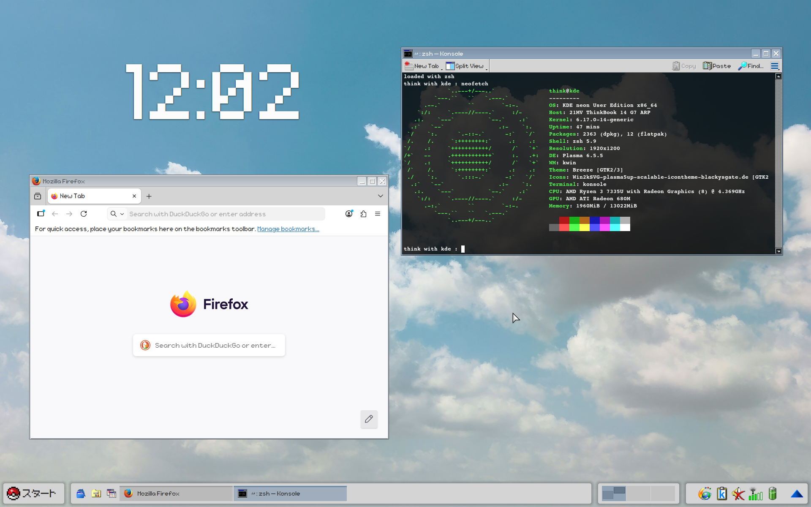

# does it really matter if I am a human or not?
## Acet9on, a liquid (it is a mix of Acetón [SK-EU] and Acetone [EN])
´working on - ricing and customizeability (trying to make something like windows 95 rice but with more compalibility of rice´

distros : I used Arch Linux, NixOS, Ubuntu (and many spinoffs), and also Manjaro / Endeavour OS

fun fact : I actually suck at coding and stuff

Look at it : 

